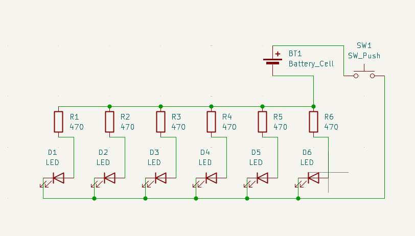
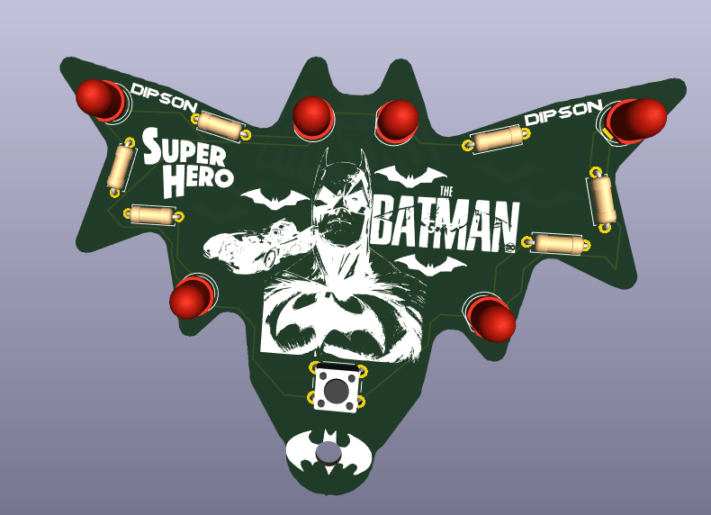
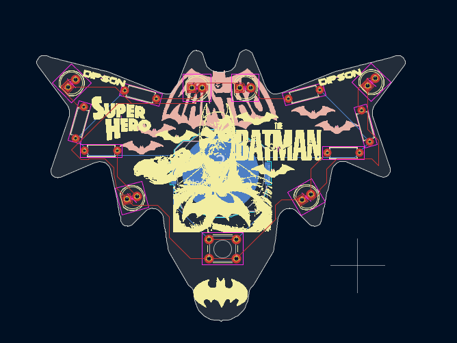

# BATMANPCB
It is an supercool batman design on a PCB batarang, with a keychain hole. It is a cell battery powered with some cool LEDs.

## Schematic

## PCB

## Features
- cell battery powered
- cool LEDs
- keychain hole
- supercool batman design on a PCB batarang

## How to build
Just order the PCB & components, open up the KiCAD file and build it accordingly.

## BOM
- 1 battery holder
- 1 switch
- 6 resistor
- 6 LED

Made by `@iamdips0n1` on slack :D

Made as a part of http://solder.hackclub.com/!
